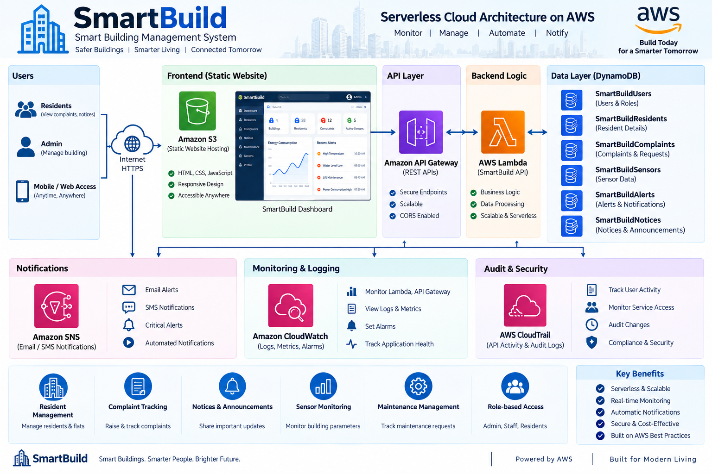
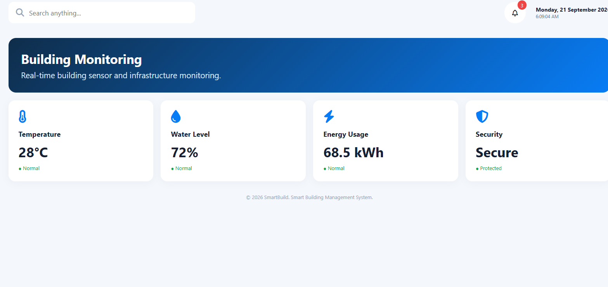
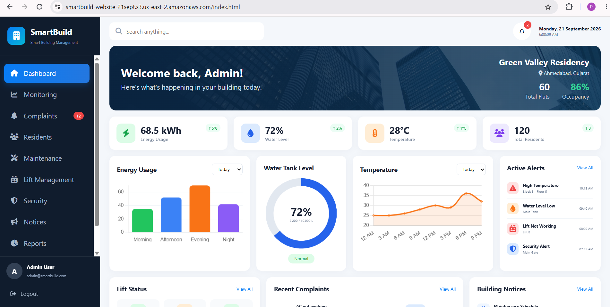
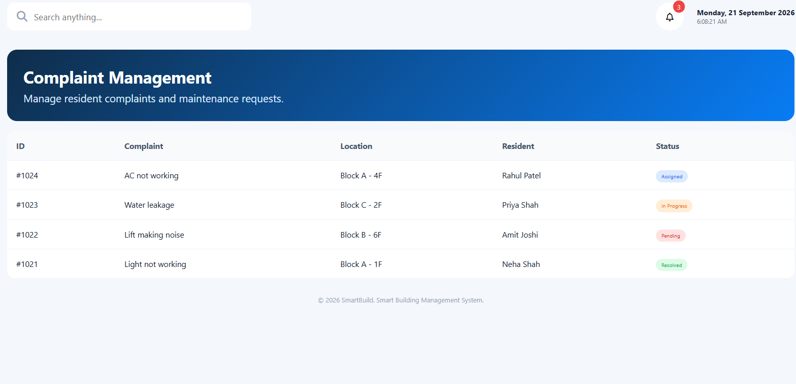
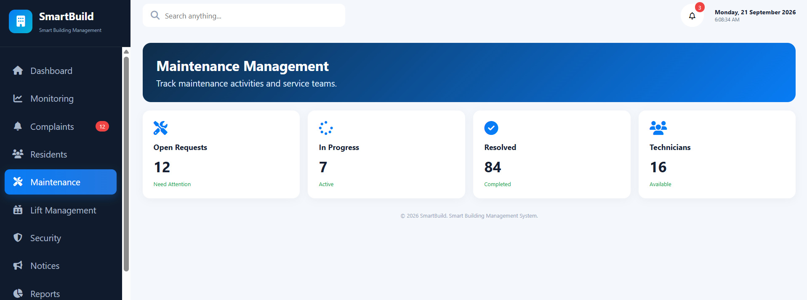
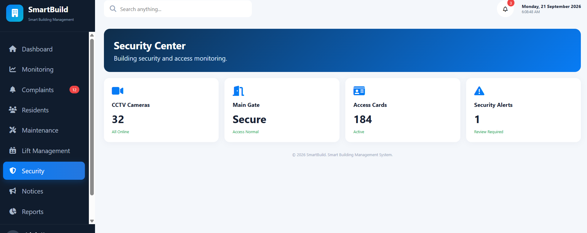

# 🏢 SmartBuild – Smart Building Management System

<p align="center">
  
</p>

<h2 align="center">Smart Building Management System</h2>

<p align="center">
  A cloud-based building management platform built with AWS serverless services,
  a responsive web dashboard, REST APIs, and DynamoDB.
</p>

<p align="center">
  <b>Monitor • Manage • Automate • Notify</b>
</p>

---

## 📌 Project Overview

**SmartBuild** is a web-based Smart Building Management System designed to provide a centralized platform for managing building operations.

The application provides a dashboard for administrators and residents to monitor building information, sensor values, complaints, maintenance activities, security information, notices, residents, lifts, and alerts.

The project is deployed using AWS cloud services and follows a serverless architecture.

### 🎯 Main Objectives

- Centralize building management activities
- Monitor building parameters
- Manage residents
- Track complaints and maintenance
- Display security alerts
- Store application data in DynamoDB
- Provide REST APIs using Amazon API Gateway
- Process backend requests using AWS Lambda
- Host the frontend using Amazon S3
- Monitor application activity using CloudWatch
- Maintain AWS activity auditing using CloudTrail
- Send notifications using Amazon SNS
- Keep the architecture ready for future IoT integration

---

# ✨ Key Features

| Feature | Description |
|---|---|
| 🏠 Dashboard | Centralized overview of the building |
| 📊 Monitoring | Electricity, water, temperature and occupancy information |
| 👥 Residents | Resident information and management |
| 🛠️ Complaints | Complaint tracking and status management |
| 🔧 Maintenance | Maintenance request overview |
| 🛗 Lift Management | Lift status and management module |
| 🛡️ Security | Building security monitoring |
| 📢 Notices | Building announcements and notices |
| 🚨 Alerts | Active building/system alerts |
| 📈 Reports | Reporting and analytics foundation |
| 🔐 Login | Custom application login architecture |
| ☁️ AWS Backend | Serverless cloud backend |
| 🗄️ DynamoDB | NoSQL data storage |
| 📩 Notifications | SNS-based notification architecture |
| 📋 Auditing | CloudTrail-based AWS activity auditing |

---

# ☁️ AWS Architecture

## Complete Architecture

<p align="center">
  
</p>

### High-Level Flow

```text
                         👤 Users / Admin
                                |
                                v
                           Internet
                                |
                                v
                    ┌────────────────────┐
                    │    Amazon S3       │
                    │  Static Website    │
                    └─────────┬──────────┘
                              |
                              v
                    ┌────────────────────┐
                    │  Amazon API        │
                    │     Gateway        │
                    └─────────┬──────────┘
                              |
                              v
                    ┌────────────────────┐
                    │    AWS Lambda      │
                    │   SmartBuildAPI    │
                    └─────────┬──────────┘
                              |
                    ┌─────────┴─────────┐
                    |                   |
                    v                   v
              DynamoDB              Amazon SNS
                    |
                    v
             SmartBuild Data
```

---

# 🔄 Request Flow

```text
User
 ↓
S3 Static Website
 ↓
JavaScript Frontend
 ↓
API Gateway
 ↓
AWS Lambda
 ↓
DynamoDB
 ↓
JSON Response
 ↓
SmartBuild Dashboard
```

### Example

```text
GET /api/residents
        ↓
Amazon API Gateway
        ↓
SmartBuildAPI Lambda
        ↓
SmartBuildResidents
        ↓
JSON Response
        ↓
Residents Table
```

---

# 🔐 Authentication Architecture

SmartBuild does **not use Amazon Cognito**.

The project uses a custom application authentication approach through the backend API.

```text
Login Page
    ↓
API Gateway
    ↓
AWS Lambda
    ↓
SmartBuildUsers
    ↓
Credential Validation
    ↓
Dashboard
```

### Login Endpoint

```text
POST /api/login
```

Example request:

```json
{
  "email": "admin@smartbuild.com",
  "password": "admin123"
}
```

> ⚠️ The current development setup is intended for project demonstration. Production authentication should use secure password hashing, token/session management, rate limiting, HTTPS, and other appropriate security controls.

---

# 🗄️ DynamoDB

SmartBuild uses Amazon DynamoDB for application data storage.

## Current Tables

| Table | Partition Key | Purpose |
|---|---|---|
| `SmartBuildUsers` | `userId` | Users and roles |
| `SmartBuildSensors` | `sensorId` | Sensor information |
| `SmartBuildResidents` | `residentId` | Resident records |
| `SmartBuildComplaints` | `complaintId` | Complaints |
| `SmartBuildAlerts` | `alertId` | System/building alerts |
| `SmartBuildLifts` | `liftId` | Lift information |
| `SmartBuildNotices` | `noticeId` | Building notices |

### DynamoDB Flow

```text
AWS Lambda
     |
     +---- SmartBuildUsers
     |
     +---- SmartBuildResidents
     |
     +---- SmartBuildComplaints
     |
     +---- SmartBuildSensors
     |
     +---- SmartBuildAlerts
     |
     +---- SmartBuildLifts
     |
     +---- SmartBuildNotices
```

---

# ⚡ AWS Lambda

Main backend Lambda function:

```text
SmartBuildAPI
```

Responsibilities:

- Process API requests
- Validate request data
- Read/write DynamoDB data
- Return JSON responses
- Handle application business logic
- Provide backend endpoints to the frontend

### Lambda Integration

```text
Amazon API Gateway
        ↓
   SmartBuildAPI
        ↓
     DynamoDB
```

---

# 🌐 Amazon API Gateway

API Gateway provides the HTTP API layer between the frontend and Lambda.

### Current API Base URL

```text
https://77h5mjj800.execute-api.us-east-2.amazonaws.com/api
```

### API Endpoints

| Method | Endpoint | Purpose |
|---|---|---|
| `GET` | `/api/health` | Health check |
| `GET` | `/api/dashboard` | Dashboard information |
| `POST` | `/api/login` | Application login |
| `GET` | `/api/users` | Get users |
| `POST` | `/api/users` | Add user |
| `GET` | `/api/residents` | Get residents |
| `POST` | `/api/residents` | Add resident |
| `GET` | `/api/complaints` | Get complaints |
| `POST` | `/api/complaints` | Add complaint |
| `GET` | `/api/sensors` | Get sensors |
| `GET` | `/api/alerts` | Get alerts |

---

# 🪣 Amazon S3

The SmartBuild frontend is hosted using Amazon S3 Static Website Hosting.

### Frontend

```text
HTML
CSS
JavaScript
```

### Hosting Flow

```text
User
 ↓
Amazon S3
 ↓
SmartBuild Web Dashboard
```

The deployed frontend contains the SmartBuild dashboard and application modules.

---

# 📩 Amazon SNS

Amazon SNS is included in the architecture for automated notifications.

```text
Critical Event
      ↓
AWS Lambda
      ↓
Amazon SNS
      ↓
Email / Notification
      ↓
Admin / Maintenance Team
```

Possible notification scenarios:

- Water level alert
- Lift maintenance alert
- High temperature
- High electricity usage
- Security alert
- Other critical building events

---

# 📊 Amazon CloudWatch

CloudWatch is used for application monitoring and logging.

### Monitoring

```text
API Gateway
     |
AWS Lambda
     |
     v
CloudWatch
     |
     +---- Logs
     +---- Metrics
     +---- Errors
     +---- Alarms
```

CloudWatch helps monitor the health and activity of the deployed backend.

---

# 📋 AWS CloudTrail

CloudTrail provides auditing of AWS account and service activity.

```text
AWS Activity
     ↓
CloudTrail
     ↓
Audit Events
     ↓
Security / Investigation
```

It can be used to review AWS API activity and changes within the account.

---

# 🔑 AWS IAM

IAM controls permissions for AWS resources.

The Lambda execution role is used to provide the backend with required permissions for services such as DynamoDB and CloudWatch, with additional permissions added as required by the architecture.

### Security Principle

```text
Least Privilege
```

Only the permissions required by a service should be granted.

---

# 📡 Future IoT Architecture

The current deployed application is IoT-ready. Physical sensors can be integrated in a future phase.

```text
Building Sensors
      ↓
AWS IoT Core
      ↓
AWS Lambda
      ↓
DynamoDB
      ↓
SmartBuild Dashboard
```

Possible sensors:

- ⚡ Electricity Sensor
- 💧 Water Level Sensor
- 🌡️ Temperature Sensor
- 👥 Occupancy Sensor
- 🛗 Lift Sensor
- 🛡️ Security Sensor

> AWS IoT Core is a planned/future integration layer and is not required for the current web application flow.

---

# 🚨 Alert Architecture

Example: water level becomes low.

```text
Water Sensor
     ↓
IoT / Application Data
     ↓
AWS Lambda
     ↓
Threshold Check
     ↓
Create Alert
     ↓
SmartBuildAlerts
     ↓
Amazon SNS
     ↓
Admin Notification
```

---

# 🖥️ Application Modules

## 🏠 Dashboard

The dashboard provides an overview of:

- Total flats
- Total residents
- Occupancy
- Electricity usage
- Water level
- Temperature
- Active alerts
- Recent complaints
- Building notices
- Lift status

---

## 📊 Building Monitoring

Monitoring dashboard displays:

```text
Temperature      → 28°C
Water Level      → 72%
Energy Usage     → 68.5 kWh
Security         → Secure
```

---

## 👥 Residents

Resident management contains:

- Resident ID
- Name
- Flat
- Phone
- Status

---

## 🛠️ Complaint Management

Complaint management provides:

- Complaint ID
- Complaint issue
- Location / Flat
- Resident
- Status
- Priority

Example statuses:

```text
Pending
In Progress
Assigned
Resolved
```

---

## 🔧 Maintenance Management

Maintenance module provides an overview of:

- Open requests
- In-progress work
- Resolved requests
- Technicians

---

## 🛗 Lift Management

The application includes a dedicated Lift Management module for displaying and managing lift-related information.

---

## 🛡️ Security Center

Security module provides a centralized view of:

- CCTV status
- Main gate status
- Access cards
- Security alerts

---

## 📢 Notices

Building notices can be used for:

- Maintenance schedules
- Important announcements
- Resident communication
- Building updates

---

## 📈 Reports

Reports module provides a foundation for future:

- Building analytics
- Energy reports
- Complaint reports
- Maintenance reports
- Resident statistics

---

# 🖼️ Project Screenshots & AWS Implementation

## ☁️ AWS Architecture


## 🌐 API Gateway


## 🗄️ DynamoDB


## 🪣 Amazon S3


## ⚡ AWS Lambda


## 🏢 Building Management



## 🏠 SmartBuild Dashboard



## 🛠️ Complaint Management



## 🔧 Maintenance Management



## 🛡️ Security Center



---

# 🛠️ Technologies Used

## Frontend

- HTML5
- CSS3
- JavaScript
- Chart.js
- Font Awesome

## Backend

- AWS Lambda
- Amazon API Gateway
- Python / Flask for local development

## Database

- Amazon DynamoDB

## AWS Services

- Amazon S3
- Amazon API Gateway
- AWS Lambda
- Amazon DynamoDB
- Amazon SNS
- Amazon CloudWatch
- AWS CloudTrail
- AWS IAM
- AWS IoT Core – planned
- Amazon CloudFront – future enhancement

---

# 📁 Project Structure

```text
smartbuild-aws/
│
├── images/
│   ├── api.jpg
│   ├── architecture.png
│   ├── building.png
│   ├── complaints.png
│   ├── dashboard.png
│   ├── db.jpg
│   ├── lambda.jpg
│   ├── maintance.png
│   ├── s3.jpg
│   └── Security.png
│
├── backend.py
├── index.html
├── README.md
└── .gitignore
```

---

# 🧪 API Testing

## Health Check

```http
GET /api/health
```

Expected response:

```json
{
  "success": true,
  "message": "SmartBuild API is working!"
}
```

## Dashboard

```http
GET /api/dashboard
```

## Residents

```http
GET /api/residents
```

## Complaints

```http
GET /api/complaints
```

## Sensors

```http
GET /api/sensors
```

## Alerts

```http
GET /api/alerts
```

---

# 🚀 Deployment

## Frontend Deployment

The frontend is hosted on Amazon S3.

```text
index.html
   ↓
Amazon S3
   ↓
Static Website
```

## Backend Deployment

```text
API Gateway
      ↓
AWS Lambda
      ↓
DynamoDB
```

## Current AWS Region

```text
US East (Ohio)
us-east-2
```

---

# 🔄 Current Architecture vs Future Architecture

## Current

```text
Users
  ↓
Amazon S3
  ↓
API Gateway
  ↓
AWS Lambda
  ↓
DynamoDB

Lambda → CloudWatch
Lambda → SNS
AWS Account → CloudTrail
Lambda → IAM
```

## Future

```text
Users
  ↓
CloudFront
  ↓
Amazon S3
  ↓
API Gateway
  ↓
AWS Lambda
  ↓
DynamoDB

Physical Sensors
  ↓
AWS IoT Core
  ↓
Lambda
  ↓
DynamoDB
  ↓
SNS
  ↓
Admin
```

---

# 🔮 Future Enhancements

- [ ] Secure password hashing
- [ ] Token/session-based authentication
- [ ] Role-based authorization
- [ ] AWS IoT Core integration
- [ ] Real-time sensor data
- [ ] SNS notification implementation
- [ ] CloudWatch alarms
- [ ] Advanced reporting
- [ ] Energy analytics
- [ ] Predictive maintenance
- [ ] Amazon CloudFront
- [ ] HTTPS production deployment
- [ ] Mobile application
- [ ] Automated infrastructure deployment
- [ ] Advanced security controls

---

# 🔒 Security Notes

- Do not commit AWS Access Keys or Secret Keys.
- Do not commit `.env` files containing credentials.
- Do not expose private API credentials.
- Use IAM least-privilege permissions.
- Passwords should be securely hashed in production.
- Use HTTPS for production deployments.
- Add proper authentication/authorization before production use.

Recommended `.gitignore`:

```gitignore
venv/
__pycache__/
*.pyc
.env
.vscode/
```

---

# 📌 Project Information

**Project Name:** SmartBuild  
**Project Type:** Smart Building Management System  
**Architecture:** AWS Serverless Cloud Architecture  
**Frontend:** HTML5, CSS3, JavaScript  
**Backend:** AWS Lambda + API Gateway  
**Database:** Amazon DynamoDB  
**Hosting:** Amazon S3  
**Monitoring:** Amazon CloudWatch  
**Notifications:** Amazon SNS  
**Auditing:** AWS CloudTrail  
**Access Management:** AWS IAM  
**IoT:** AWS IoT Core – planned  

---

# 🌟 Project Highlights

```text
☁️ AWS Cloud
⚡ Serverless Backend
🗄️ DynamoDB Database
🌐 REST APIs
📊 Monitoring Dashboard
👥 Resident Management
🛠️ Complaint Management
🔧 Maintenance Management
🚨 Alerts
📩 Notifications
📋 Cloud Auditing
🔐 IAM Security
📡 IoT-Ready Architecture
```

---

# 👨‍💻 Author

**Prince Vaghasiya**

GitHub:  
https://github.com/Prince16605

---

# 📂 GitHub Repository

**SmartBuild AWS**

https://github.com/Prince16605/smartbuild-aws

---

## ⭐ Project

SmartBuild demonstrates a practical AWS-based approach to building a centralized, scalable, serverless Smart Building Management System.

**Smart Buildings. Smarter Living. Connected Tomorrow.**
